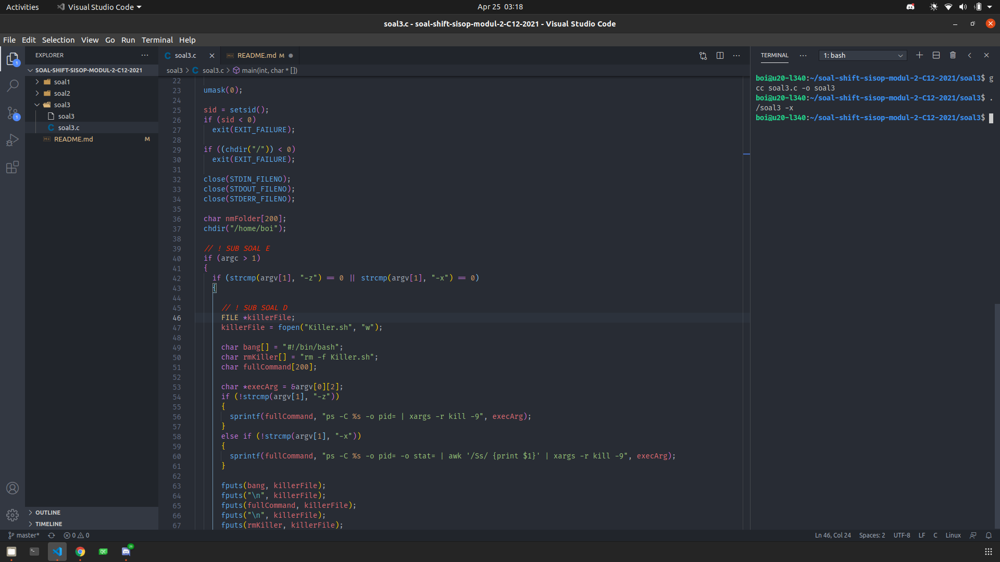
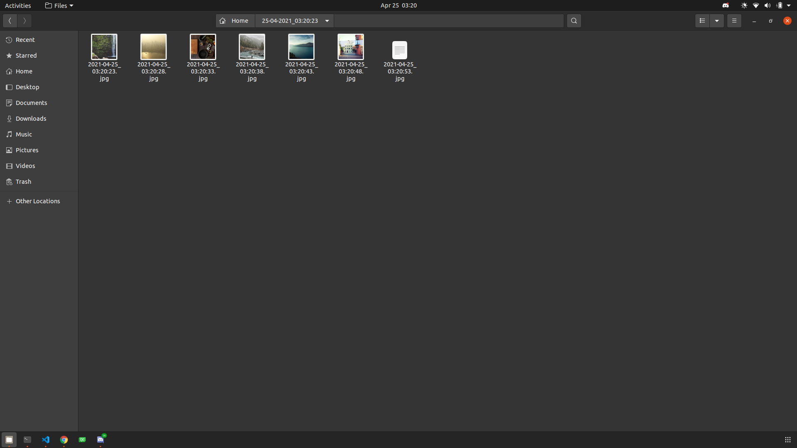
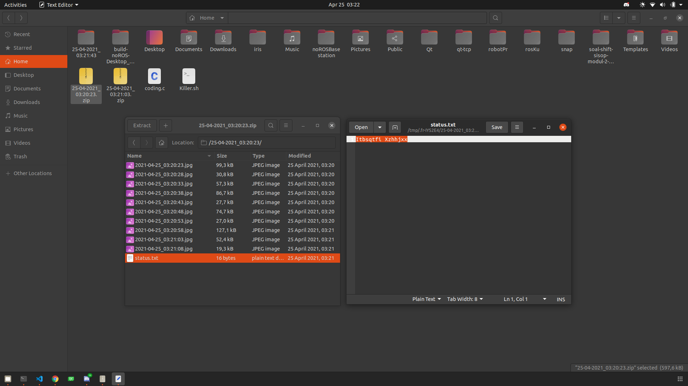

# Laporan Penjelasan Soal Shift Modul 2

## Anggota

- Mohammad Faderik Izzul Haq (05111940000023)
- Jonathan Timothy Siregar (05111940000120)
- Abiya Sabitta Ragadani (05111940000166)

## SOAL 1

## SOAL 2

## SOAL 3

Pada soal ini kita diminta membuat program yang berupa daemon proses yang akan mendownload file dari link tertentu berdasarkan waktu proses tersebut berjalan.

### Kendala yang dihadapi

Pada pengerjaan soal ini, kami sempat mengalami kendala karena command wget tidak bisa berjalan dengan exec. Kami sempat stuck karena tidak mengetahui error nya terletak dimana. Namun setelah kami coba run program yang sama di komputer lain, ternyata program bisa berjalan. Jadi kami simpulkan komputer pertama yang kami gunakan (Ubuntu 16.04) terdapat masalah yang sampai saat ini belum kami ketahui. Selain itu pada masa pengerjaan soal shift kami belum banyak tahu tentang argumen program dan kill program dari dalam program. Sehingga kami belum sempat selesai mengerjakan sampai ke sub soal D dan E. Selain itu kami sempat melakukan kesalahan pada penempatan lokasi exit() sehingga proses berjalan sangat banyak dan membuat komputer hang.

### Sub Soal A

Pada soal A kita diminta membuat direktori setiap 40 detik dengan nama direktori merupakan waktu saat ini dengan format sesuai timestamp [YYYY-mm-dd_HH:ii:ss].

```cpp
int main(){
while (1)
    {
      // program utama
    }
    sleep(40);
}

```

Program soal A ini secara keseluruhan berada dalam while daemon seperti kode diatas.

```cpp
time_t ta = time(NULL);
struct tm tms = *localtime(&ta);
sprintf(nmFolder,
        "%02d-%02d-%d_%02d:%02d:%02d",
        tms.tm_mday,
        tms.tm_mon + 1,
        tms.tm_year + 1900,
        tms.tm_hour,
        tms.tm_min,
        tms.tm_sec);

pid_t pidA;
pidA = fork();
int stsA;
chdir("/home/boi");

if (pidA < 0)
  exit(EXIT_FAILURE);
if (pidA == 0)
{
  char *argv[] = {"mkdir", nmFolder, NULL};
  execv("/bin/mkdir", argv);
}
```

Program diatas merupakan child proses untuk membuat folder dengan nama direktori dari string yang digenerate dari waktu saat ini.

### Sub Soal B

Pada sub soal B diminta untuk mengisi direktori yang sudah dibuat dengan 10 gambar yang didownload dari https://picsum.photos/, dimana setiap gambar akan didownload setiap 5 detik. Setiap gambar yang didownload akan diberi nama dengan format timestamp [YYYY-mm-dd_HH:ii:ss] dan gambar tersebut berbentuk persegi dengan ukuran (n%1000) + 50 pixel dimana n adalah detik Epoch Unix. Untuk itu dapat melanjutkan proses milik poin A, dengan else dan memanggil fungsi wait () untuk memasstikan pembuatan folder telah selesai

```cpp
while ((wait(&stsA)) > 0);
char curFolder[200];
strcpy(curFolder, nmFolder);
chdir(curFolder);
```

Jika pembuatan direktori telah selesai, pindah ke direktori tersebut dengan fungsi chdir(), jika telah masuk ke direktori tersebut,lakukan perulangan sebanyak 10 kali yang setiap iterasinya melakukan hal berikut. Pertama persiapkan variabel untuk memberi nama file dengan cara yang sama dengan sub soal A. Lalu download file dengan command wget dengan perintah fork() dan exec() dan beri nama file dengan variabel yang telah dibuat sebelumnya. Setelah proses download dilakukan, tunggu selama 5 detik dengan fungsi sleep(5)

```cpp
while (lop < 10)
{
  int epoch = time(NULL);
  char linkDL[200];
  // sprintf(linkDL, "https://picsum.photos/50");
  sprintf(linkDL, "%s/%d", "https://picsum.photos", (epoch % 1000) + 5);

  char nmFile[200];
  time_t tb = time(NULL);
  struct tm tms = *localtime(&tb);
  sprintf(nmFile, "%d-%02d-%02d_%02d:%02d:%02d.jpg",
          tms.tm_year + 1900,
          tms.tm_mon + 1,
          tms.tm_mday,
          tms.tm_hour,
          tms.tm_min,
          tms.tm_sec);

  pid_t pidB;
  pidB = fork();

  if (pidB == 0)
  {
    char *argv[] = {"wget", "-qO", nmFile, linkDL, NULL};
    execv("/bin/wget", argv);
    exit(0);
  }

  lop++;
  sleep(5);
}
```

### Sub Soal C

Pada soal C ini diminta untuk membuat file `status.txt` dengan isi "Download Success" yang dienskripsi dengan teknik caesar ciper shift 5. Setelah proses soal B selesai, file status.txt dimasukan kedalam direktori tersebut dan direktori tersebut di Zip. selanjutnya program akan menunggu proses zip selesai dengan fork() proses baru dan memanggil zip dengan exec. Setelah itu program menjalankan perintah untuk menghapus direktori yang baru saja di Zip dengan fork() dengan mamanggil rm -rf dengan exec.

```cpp
FILE *stsFile;
stsFile = fopen("status.txt", "w");

if (stsFile == NULL)
  exit(EXIT_FAILURE);

char success[50] = "Download Success", temp;

// -- ALGORITMA CAESAR CIPER ...

fputs(success, stsFile);
fclose(stsFile);

chdir("/home/boi");
pid_t pidC;
pidC = fork();
int stsC;

if (pidC == 0)
{
  char nmZip[300];
  sprintf(nmZip, "%s.zip", nmFolder);
  char *argv[] = {"zip", "-r", nmZip, nmFolder, NULL};
  execv("/bin/zip", argv);
}
else
{
  while (wait(&stsC) > 0);

  char *argv[] = {"rm", "-rf", nmFolder, NULL};
  execv("/bin/rm", argv);
}
```

Untuk algoritma caesar ciper dengan shift 5 sendiri dapat dilihat pada kode berikut.

```cpp
for (int i = 0; success[i] != '\0'; ++i)
{
  temp = success[i];

  if (temp >= 'a' && temp <= 'z')
  {
    temp += 5;
    if (temp > 'z')
    {
      temp = temp - 'z' + 'a' - 1;
    }

    success[i] = temp;
  }
  else if (temp >= 'A' && temp <= 'Z')
  {
    temp += 5;
    if (temp > 'Z')
    {
      temp = temp - 'Z' + 'A' - 1;
    }

    success[i] = temp;
  }
}
```

### Sub Soal D dan E

Pada soal ini diminta untukk membuat program killer yang akan mengehntikan proses daemon bedasar argumen yang dimasukkan. Untuk mengkill proses kami mencari proses menggunakan awk yang memiliki nama soal3 dan diambil id nya untuk di kill. Seluruh command yang diperlukan diletakan ke file Killer.sh dengan format bash. lalu file tersebut di beri akses agar bisa di execute dengan perintah chmod +x Killer.sh.

```cpp
if (strcmp(argv[1], "-z") == 0 || strcmp(argv[1], "-x") == 0)
{
  FILE *killerFile;
  killerFile = fopen("Killer.sh", "w");

  char bang[] = "#!/bin/bash";
  char rmKiller[] = "rm -f Killer.sh";
  char fullCommand[200];

  char *execArg = &argv[0][2];
  if (!strcmp(argv[1], "-z"))
  {
    sprintf(fullCommand, "ps -C %s -o pid= | xargs -r kill -9", execArg);
  }
  else if (!strcmp(argv[1], "-x"))
  {
    sprintf(fullCommand, "ps -C %s -o pid= -o stat= | awk '/Ss/ {print $1}' | xargs -r kill -9", execArg);
  }

  fputs(bang, killerFile);
  fputs("\n", killerFile);
  fputs(fullCommand, killerFile);
  fputs("\n", killerFile);
  fputs(rmKiller, killerFile);
  fclose(killerFile);

  char commandBash[50];
  sprintf(commandBash, "chmod u+x %s", "Killer.sh");
  FILE *runBash = popen(commandBash, "w");
  pclose(runBash);
}
```

### Screenshoot

> Executing program

<p align="center">
  
</p>

> Proses download file gambar

<p align="center">
  
</p>

> Hasil folder, zip folder, status.txt, dan file Killer.sh

<p align="center">
  
</p>
