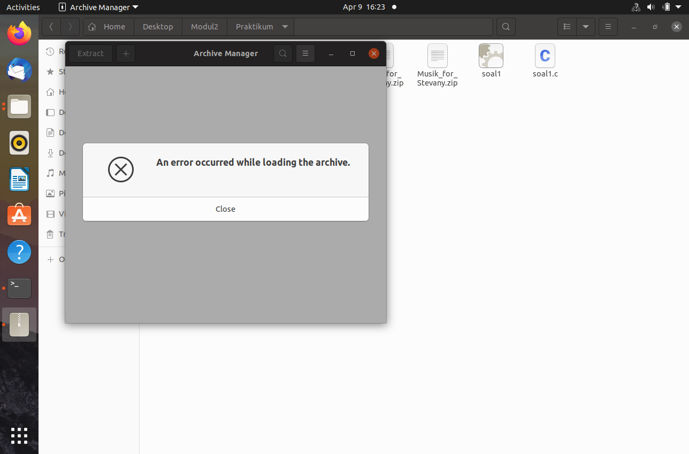

# Laporan Penjelasan Soal Shift Modul 2

## Anggota

- Mohammad Faderik Izzul Haq (05111940000023)
- Jonathan Timothy Siregar (05111940000120)
- Abiya Sabitta Ragadani (05111940000166)

## SOAL 1

Pada soal ini diminta untuk membuat program dimana akan mendownload zip pada waktu tertentu memintanya untuk di ekstrak dan dipindahkan ke folder baru, kemudian pada waktu tertentu selanjutnya folder baru tersebut di zip menjadi 1.

### Sub Soal A

Untuk sub soal a diminta untuk pertama membuat folder yang bernama Fylm, Pyoto, dan Musyik. Oleh karena itu digunakan 1 fungsi bernama makeDir() dimana menggunakan 2 fork proses. Sehingga menghasilkan 3 proses, dimana tiap proses membuat folder dengan menggunakan execv("/bin/mkdir", arg) dengan arg adalah `mkdir`, `-p`, dan Folder yang ingin dibuat.
```cpp
void makeDir(){
 pid_t child;
 child = fork();
 if(child < 0) exit(EXIT_FAILURE);
 if(child == 0){
 	pid_t child_2;
	child_2 = fork();
	if(child_2 < 0) exit(EXIT_FAILURE);
	if(child_2 == 0){
		char *arg[]={"mkdir", "-p", "/home/abit/Desktop/Modul2/Praktikum/Musyik", NULL};
		execv("/bin/mkdir", arg);}
	else{
		char *arg2[]={"mkdir", "-p", "/home/abit/Desktop/Modul2/Praktikum/Fylm", NULL};
		execv("/bin/mkdir", arg2);}
 }
 else{
	char *arg3[]={"mkdir", "-p", "/home/abit/Desktop/Modul2/Praktikum/Pyoto", NULL};
	execv("/bin/mkdir", arg3);}
}
```

### Sub Soal B & C

Sub soal b diminta untuk mendownload zip dari link yang diberikan dan sub soal c meminta untuk mengekstrak zip yang sudah didownload. Untuk mendownload dan mengekstrak film, foto, dan musik memiliki fungsi yang terpisah namun hanya memiliki perbedaan pada link download dan nama. Digunakannya 2 fork sehingga bisa menjalankan 3 proses, untuk proses pertama mendownload yaitu dengan `execv("/bin/wget", argument)` dimana argumentnya adalah `wget` command untuk mendownload, `-bq` untuk menjalankan proses tanpa menghasilkan log, kemudian `--no-check-certificate` serta link download, dan diikuti oleh `-O` untuk menyimpan dengan nama argumen setelahnya. Setelah itu dijalankan proses ke-2 yaitu meng-unzip. Untuk mengunzip menggunakan wait dan sleep untuk menunggu selesai download. kemudian menggunakan execv unzip dan argummen dimana argumennya adalah `unzip` diikuti dengan path zip.

```cpp
void foto(){
 pid_t child;
 int flag;
 child = fork();
 if(child < 0) exit(EXIT_FAILURE);
 if(child == 0){
	pid_t child_2;
	int flag2;
	child_2 = fork();
	if(child_2 < 0) exit(EXIT_FAILURE);
	if(child_2 == 0){
		char *argument[] = {"wget", "-bq", "--no-check-certificate", "https://drive.google.com/uc?id=1FsrAzb9B5ixooGUs0dGiBr-rC7TS9wTD&export=download", "-O", "Foto_for_Stevany.zip", NULL};
		execv("/bin/wget", argument);}
	else{
		while((wait(&flag2))>0);
		sleep(30);
		char *argument2[] = {"unzip", "/home/abit/Desktop/Modul2/Praktikum/Foto_for_Stevany.zip", NULL};
 		execv("/bin/unzip",argument2);}
 }
 else{
 while((wait(&flag)) > 0);
 Pindah("FOTO","Pyoto");}
}
```
### Sub Soal D

Untuk sub soal D diminta untuk memindahkan hasil ekstrak tersbut kedalam folder yang sudah dibuat. Sehingga digunakannya fungsi move menggunakan directory listing untuk melihat file apa saja yang ada di dalam directory namun dilakukan secara rekursif list nya menggunakan dp->d_name untuk mengelist nama dari file yang ada di dalam directory tersebut kemudian menggunakan strcopy dan strcat untuk mengganti nama dan menggabungkan namanya.
```cpp
void Pindah(char *base, char*tujuan){
 struct dirent *p;
 char pt[1000];
 DIR *dir = opendir(base);

 if(!dir) return;
 while((p = readdir(dir)) != NULL){
 	if(strcmp(p->d_name, ".") != 0 && strcmp(p->d_name, "..") != 0){
		strcpy(pt, base);
		strcat(pt, "/");
		strcat(pt, p->d_name);
		Pindah2(pt, tujuan);}
 }
 closedir(dir);
}
```
```cpp
void Pindah2(char *file, char *folder){
 pid_t child;
 child = fork();
 int flag;
 if(child < 0) exit(EXIT_FAILURE);
 if(child == 0){
	char *arg[]={"mv", file, folder, NULL};
	execv("/bin/mv", arg);}
 else{
 while((wait(&flag)) > 0);}
}
```

### Sub Soal E dan F

Untuk soal e diminta untuk menjalankan program diatas jika hari tersebut memiliki tanggal 9-April dengan jam 16:22, dan Sub soal F diminta untuk zip pada hari yang sama dan jam 22:22. Dan ada aturan bahwa hanya dijalani oleh 1 script dan jalan di background. Oleh karena itu digunakannya daemon. Untuk menjalankan script pada waktu tertentu menggunakan time dan membandingkan waktu sekarang dengan tanggal 9-April kemudian membandingkan dengan jamnya menggunakan if.

```cpp
...

  while (1) {
	char waktu[100];
	time_t now =time(0);
	struct tm tstruct;
	tstruct = *localtime(&now);
	strftime(waktu, sizeof(waktu), "%d-%m__%H-%M", &tstruct);
	if(strcmp("09-04__16-22",waktu) == 0){
		jalan();
		apusfolder("/home/abit/Desktop/Modul2/Praktikum");}
	else if(strcmp("09-04__22-22", waktu) == 0)zip();
    
	sleep(1);
  }
}
...
```
Kemudian untuk menjalankan program sub soal sebelumnya digunakannya fungsi jalan pada waktu 16:22 pada 9 April. Pada fungsi ini menggunakan 3 fork dimana menjalankan 4 proses dimana pertama menjalankan makeDir(), kemudian diikuti menjalankan fungsi foto, film, dan musik.
```cpp

void jalan(){
 pid_t child;
 child = fork();
 int flag;
 if(child<0) exit(EXIT_FAILURE);
 if(child == 0){
 	pid_t child_2;
	child_2 = fork();
	int flag2;

	if(child_2 <0) exit(EXIT_FAILURE);
	if(child_2 == 0){
		pid_t child_3;
		child_3 = fork();
		int flag3;
		if(child_3 <0)exit(EXIT_FAILURE);
		if(child_3 ==0) makeDir();
		else{
		while((wait(&flag3)) > 0);
		foto();
		_exit(1);}
	}
	else{
		while((wait(&flag2)) > 0);
		film();
		_exit(1);}
 }
 else{
	while((wait(&flag)) > 0);
	musik();
 }
}
```
Kemudian untuk menghapus folder selain yang sudah dibuat menggunakan fungsi apusfolder. Dimana cara kerja mirip seperti fungsi pindah, dimana digunakannya directory listing kemudian membandingkan nama file dengan FILM, FOTO, MUSIK. Kemudian menggunakan rm untuk menghapus folder tersebut.
```cpp
void apusfolder(char* base){
	char path[1000];
	struct dirent *dp;
	DIR *dir = opendir(base);
	
	if(!dir) return;
	while((dp=readdir(dir)) != NULL){
		if(strcmp(dp->d_name, ".") != 0 && strcmp(dp->d_name, "..") !=0){
			strcpy(path, base);
			strcat(path, "/");
			strcat(path, dp->d_name);
			if(strcmp(dp->d_name, "FILM") == 0 || strcmp(dp->d_name, "FOTO") == 0 || strcmp(dp->d_name, "MUSIK") == 0){
			apusfolder2(path);}
		}
	}
}

void apusfolder2(char* tujuan){
	pid_t child;
	child = fork();
	int flag;
	if(child < 0)exit(EXIT_FAILURE);
	if(child == 0){
		char *arg[]={"rm", "-rf", tujuan, NULL};
		execv("/bin/rm",arg);
	}
	else{
		while((wait(&flag)) > 0);
	}
}
```

Dan terakhir untuk zip folder, menggunakan execv zip untuk menzip folder yang diinginkan.
```cpp
void zip(){
 char *arg[]={"zip","-mr","Lopyu_Stevany.zip","Pyoto","Fylm","Musyik",NULL};
 execv("/bin/zip",arg);
}
```
## Kendala
Kendala yang dialami pada saat mendownload filenya mengalami corrupt sehingga tidak dapat diekstrak. 
<p align="center">
  
</p>
Solusi yang digunakan adalah menambahkan waktu sleep diantara proses download dan ekstrak.

### Hasil
> Hasil ketika tanggal 9 April pukul 16:22
<p align="center">
  
</p>
> Hasil ketika tanggal 9 April pukul 22:22
<p align="center">
  
</p>


## SOAL 2

Pada soal ini, diberikan sebuah file berekstensi zip. Lalu kita diminta untuk membuat sebuah program yang dapat melakukan unzip, pemisahan file dan folder, dan penghapusan folder(yang tidak berguna). Setelah itu kita akan mendapatkan file `.jpg` dengan format nama file `jenis;nama;umur.jpg`. Lantas tugas kita yakni mengategorikan setiap file tersebut, memasukkannya ke folder yang sesuai dengan jenisnya, dan menambahkan apendix `keterangan.txt` yang berisikan data nama dan umur dari tiap hewan dalam satu folder.

### Sub Soal A 
#### Unzip dan Remove

Pada sub-soal 2A, kita diminta untuk melakukan unzip dan menghapus folder(yang tidak penting)


```cpp
int unzipper () {
  pid_t child_id;
    int status;

  child_id = fork();

   if (child_id < 0) {
   exit(EXIT_FAILURE);
   }

  if (child_id == 0) {

    	char *argv[] = {"unzip", from , "-x", "*/*", "-d", to, NULL};
    	execv("/usr/bin/unzip", argv);
	exit(EXIT_SUCCESS);
	}
    while ((wait(&status)) > 0);

}
```

Fungsi `unzipper()` berfugsi untuk mengunzip `pets.zip`.

```cpp
void checker() {
    char src[1000];
    struct dirent *ep;
    DIR *dp = opendir(to);
    if (!dp) return;

//  ep = readdir(dp);

    while ((ep = readdir(dp)) != NULL) {
        if (!strcmp(ep->d_name, ".") == 0 && !strcmp(ep->d_name, "..") == 0) { // menghindari file . atau .. sehingga hanya jpg yang diambil
            char NF[50];
            strcpy(NF, ep->d_name);

            createDir(NF);
            remDir(ep->d_name);
        }
    }
}
```

Fungsi checker berfungsi untuk mengecek apakah file yang ada di pets.zip merupakan `.` atau `..`. Apabila file tersebut merupakan folder atau direktori, maka akan dimasukkan ke variabel `(ep->d_name)` yang kemudian akan masuk ke fungsi `remDir()` untuk dihapus. Sisanya akan dimasukkan ke variabel `NF` yang nantinya akan dimasukkan  ke fungsi `createDir()` untuk dibuatkan folder sesuai jenis hewan peliharaan tersebut.


```cpp
void remDir (char *NF) {

    pid_t child_id;

    int status;
    char source[150];
    sprintf(source, "%s/%s", to, NF);

    char *argv[] = {"rm", "-f", source, NULL};

    child_id = fork();
    if (child_id == 0)
        execv("/bin/rm", argv);
    else //parent
        (wait(&status) > 0);
}

```


### Sub Soal B
#### mkdir

Pada sub soal ini, kita akan membuat folder sesuai dengan jenis daripada gambar hewan peliharaan tersebut.

```cpp
void createDir(char *NF) {
    char temp[150]; 
    char *token1, *token2;
    char *ptrtok1, *ptrtok2;
    char *strptr = NF;

    strcpy(temp, NF);


    while (1) {
        char petName[100];
        char afName[150];
	char befName[150];

        token1 = strtok_r(strptr, "_", &ptrtok1);
        if (!token1) break;

        token2 = strtok_r(token1, ";", &ptrtok2);
        if (!token2) break;

        sprintf(petName, "%s/%s", to, token2);
        char *argv1[] = {"mkdir", "-p", petName, NULL};


    	pid_t child_id2;
   	int status;
    	child_id2 = fork();
    	if (child_id2 == 0)
          execv("/bin/mkdir", argv1);
        else
        ((wait(&status)) > 0);
        	}
	}
```

Pada fungsi `createDir()` di atas, terdapat fungsi `strtok_r` untuk memisahkan antar pets yang dipisahkan dengan `_` dan memisahkan antar jenis, nama, dan umur yang dipisahkan dengan `;`. Pada `token2` yang pertama, diambil jenis daripada hewan peliharaan tersebut. `token2` tersebut yang nantinya akan dijadikan nama dari folder hewan peliharaan tersebut.

### Sub soal C & D
#### cp

Pada sub soal C & D, kita diminta untuk mengganti nama file yang sebelumnya `jenis;nama;umur.jpg` menjadi hanya `nama.jpg`. Akan tetapi, file yang mengandung 2 jenis nama, akan dipisahkan dan dimasukkan ke masing-masing folder.

```cpp
        sprintf(befName, "%s/%s", to, temp);
        sprintf(afName, "%s/%s.jpg", petName, token2);

        char *argv2[] = {"cp", befName, afName, NULL};


    	pid_t child_id1;
    	child_id1 = fork();
    	if (child_id1 == 0)
          execv("/bin/cp", argv2);
        else
        ((wait(&status)) > 0);
```

<p align="center">
	
	<br>
	Hasil direktori petshop yang telah diisi folder pets
	<br>
</p>

<br><br>

<p align="center">
	
	<br>
	Hasil salah satu direktori pets (cat)
	<br>
</p>
<br>


### Sub soal E

Pada sub soal E, kita diminta membuat suatu apendix bernama keterangan.txt yang berisikan nama dan umur hewan peliharaan.

```cpp
void keterangan (char *dp, char *age, char *finName) {
    char detil[150];
    char print[200];

    sprintf(detil, "name\t: %s\numur\t: %s\n\n", finName, age);
    sprintf(print, "%s/keterangan.txt", dp);
    FILE *fptrout = fopen(print, "a");
    fputs(detil, fptrout);
    fclose(fptrout);
}
```

<p align="center">
	
	<br>
	isi keterangan.txt pada folder cat
	<br>
</p>

<br><br>

## SOAL 3

Pada soal ini kita diminta membuat program yang berupa daemon proses yang akan mendownload file dari link tertentu berdasarkan waktu proses tersebut berjalan.

### Kendala yang dihadapi

Pada pengerjaan soal ini, kami sempat mengalami kendala karena command wget tidak bisa berjalan dengan exec. Kami sempat stuck karena tidak mengetahui error nya terletak dimana. Namun setelah kami coba run program yang sama di komputer lain, ternyata program bisa berjalan. Jadi kami simpulkan komputer pertama yang kami gunakan (Ubuntu 16.04) terdapat masalah yang sampai saat ini belum kami ketahui. Selain itu pada masa pengerjaan soal shift kami belum banyak tahu tentang argumen program dan kill program dari dalam program. Sehingga kami belum sempat selesai mengerjakan sampai ke sub soal D dan E. Selain itu kami sempat melakukan kesalahan pada penempatan lokasi exit() sehingga proses berjalan sangat banyak dan membuat komputer hang.

### Sub Soal A

Pada soal A kita diminta membuat direktori setiap 40 detik dengan nama direktori merupakan waktu saat ini dengan format sesuai timestamp [YYYY-mm-dd_HH:ii:ss].

```cpp
int main(){
while (1)
    {
      // program utama
    }
    sleep(40);
}

```

Program soal A ini secara keseluruhan berada dalam while daemon seperti kode diatas.

```cpp
time_t ta = time(NULL);
struct tm tms = *localtime(&ta);
sprintf(nmFolder,
        "%02d-%02d-%d_%02d:%02d:%02d",
        tms.tm_mday,
        tms.tm_mon + 1,
        tms.tm_year + 1900,
        tms.tm_hour,
        tms.tm_min,
        tms.tm_sec);

pid_t pidA;
pidA = fork();
int stsA;
chdir("/home/boi");

if (pidA < 0)
  exit(EXIT_FAILURE);
if (pidA == 0)
{
  char *argv[] = {"mkdir", nmFolder, NULL};
  execv("/bin/mkdir", argv);
}
```

Program diatas merupakan child proses untuk membuat folder dengan nama direktori dari string yang digenerate dari waktu saat ini.

### Sub Soal B

Pada sub soal B diminta untuk mengisi direktori yang sudah dibuat dengan 10 gambar yang didownload dari https://picsum.photos/, dimana setiap gambar akan didownload setiap 5 detik. Setiap gambar yang didownload akan diberi nama dengan format timestamp [YYYY-mm-dd_HH:ii:ss] dan gambar tersebut berbentuk persegi dengan ukuran (n%1000) + 50 pixel dimana n adalah detik Epoch Unix. Untuk itu dapat melanjutkan proses milik poin A, dengan else dan memanggil fungsi wait () untuk memasstikan pembuatan folder telah selesai

```cpp
while ((wait(&stsA)) > 0);
char curFolder[200];
strcpy(curFolder, nmFolder);
chdir(curFolder);
```

Jika pembuatan direktori telah selesai, pindah ke direktori tersebut dengan fungsi chdir(), jika telah masuk ke direktori tersebut,lakukan perulangan sebanyak 10 kali yang setiap iterasinya melakukan hal berikut. Pertama persiapkan variabel untuk memberi nama file dengan cara yang sama dengan sub soal A. Lalu download file dengan command wget dengan perintah fork() dan exec() dan beri nama file dengan variabel yang telah dibuat sebelumnya. Setelah proses download dilakukan, tunggu selama 5 detik dengan fungsi sleep(5)

```cpp
while (lop < 10)
{
  int epoch = time(NULL);
  char linkDL[200];
  // sprintf(linkDL, "https://picsum.photos/50");
  sprintf(linkDL, "%s/%d", "https://picsum.photos", (epoch % 1000) + 5);

  char nmFile[200];
  time_t tb = time(NULL);
  struct tm tms = *localtime(&tb);
  sprintf(nmFile, "%d-%02d-%02d_%02d:%02d:%02d.jpg",
          tms.tm_year + 1900,
          tms.tm_mon + 1,
          tms.tm_mday,
          tms.tm_hour,
          tms.tm_min,
          tms.tm_sec);

  pid_t pidB;
  pidB = fork();

  if (pidB == 0)
  {
    char *argv[] = {"wget", "-qO", nmFile, linkDL, NULL};
    execv("/bin/wget", argv);
    exit(0);
  }

  lop++;
  sleep(5);
}
```

### Sub Soal C

Pada soal C ini diminta untuk membuat file `status.txt` dengan isi "Download Success" yang dienskripsi dengan teknik caesar ciper shift 5. Setelah proses soal B selesai, file status.txt dimasukan kedalam direktori tersebut dan direktori tersebut di Zip. selanjutnya program akan menunggu proses zip selesai dengan fork() proses baru dan memanggil zip dengan exec. Setelah itu program menjalankan perintah untuk menghapus direktori yang baru saja di Zip dengan fork() dengan mamanggil rm -rf dengan exec.

```cpp
FILE *stsFile;
stsFile = fopen("status.txt", "w");

if (stsFile == NULL)
  exit(EXIT_FAILURE);

char success[50] = "Download Success", temp;

// -- ALGORITMA CAESAR CIPER ...

fputs(success, stsFile);
fclose(stsFile);

chdir("/home/boi");
pid_t pidC;
pidC = fork();
int stsC;

if (pidC == 0)
{
  char nmZip[300];
  sprintf(nmZip, "%s.zip", nmFolder);
  char *argv[] = {"zip", "-r", nmZip, nmFolder, NULL};
  execv("/bin/zip", argv);
}
else
{
  while (wait(&stsC) > 0);

  char *argv[] = {"rm", "-rf", nmFolder, NULL};
  execv("/bin/rm", argv);
}
```

Untuk algoritma caesar ciper dengan shift 5 sendiri dapat dilihat pada kode berikut.

```cpp
for (int i = 0; success[i] != '\0'; ++i)
{
  temp = success[i];

  if (temp >= 'a' && temp <= 'z')
  {
    temp += 5;
    if (temp > 'z')
    {
      temp = temp - 'z' + 'a' - 1;
    }

    success[i] = temp;
  }
  else if (temp >= 'A' && temp <= 'Z')
  {
    temp += 5;
    if (temp > 'Z')
    {
      temp = temp - 'Z' + 'A' - 1;
    }

    success[i] = temp;
  }
}
```

### Sub Soal D dan E

Pada soal ini diminta untukk membuat program killer yang akan mengehntikan proses daemon bedasar argumen yang dimasukkan. Untuk mengkill proses kami mencari proses menggunakan awk yang memiliki nama soal3 dan diambil id nya untuk di kill. Seluruh command yang diperlukan diletakan ke file Killer.sh dengan format bash. lalu file tersebut di beri akses agar bisa di execute dengan perintah chmod +x Killer.sh.

```cpp
if (strcmp(argv[1], "-z") == 0 || strcmp(argv[1], "-x") == 0)
{
  FILE *killerFile;
  killerFile = fopen("Killer.sh", "w");

  char bang[] = "#!/bin/bash";
  char rmKiller[] = "rm -f Killer.sh";
  char fullCommand[200];

  char *execArg = &argv[0][2];
  if (!strcmp(argv[1], "-z"))
  {
    sprintf(fullCommand, "ps -C %s -o pid= | xargs -r kill -9", execArg);
  }
  else if (!strcmp(argv[1], "-x"))
  {
    sprintf(fullCommand, "ps -C %s -o pid= -o stat= | awk '/Ss/ {print $1}' | xargs -r kill -9", execArg);
  }

  fputs(bang, killerFile);
  fputs("\n", killerFile);
  fputs(fullCommand, killerFile);
  fputs("\n", killerFile);
  fputs(rmKiller, killerFile);
  fclose(killerFile);

  char commandBash[50];
  sprintf(commandBash, "chmod u+x %s", "Killer.sh");
  FILE *runBash = popen(commandBash, "w");
  pclose(runBash);
}
```

### Screenshoot

> Executing program

<p align="center">
  
</p>

> Proses download file gambar

<p align="center">
  
</p>

> Hasil folder, zip folder, status.txt, dan file Killer.sh

<p align="center">
  
</p>
